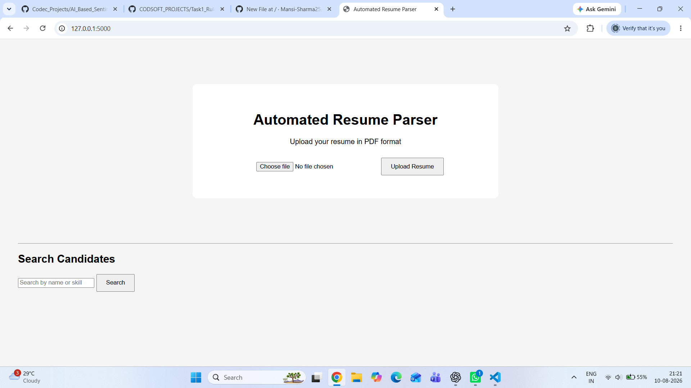
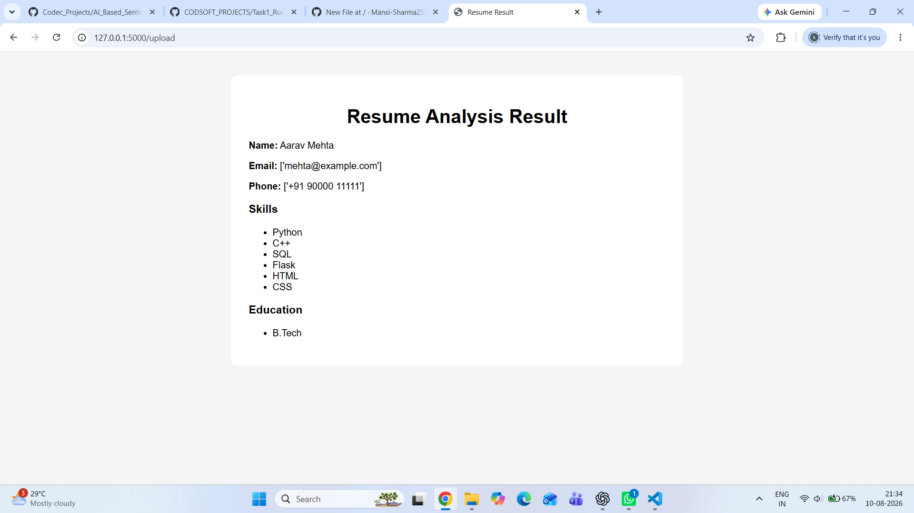
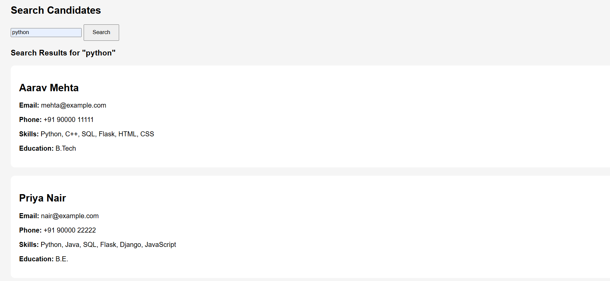

# Automated Resume Parser

An automated resume parsing web application built with Python and Flask. The application allows users to upload PDF resumes, automatically extracts important candidate information, stores the extracted data in a SQLite database and provides a search functionality to find stored candidates. The project uses **PDFPlumber** to read resume content and **Regular Expressions** to identify contact details, while keyword-based matching is used to detect skills and education-related information.

## 📌 Project Overview

The parser reads the resume, extracts its useful information, and identifies:

* Candidate Name
* Email Address
* Phone Number
* Technical Skills
* Education-related Information

The extracted information is returned in a structured format that can be further used for candidate screening or storage.

## ✨ Features

* 📄 Extracts text from PDF resumes
* 👤 Identifies the candidate's name
* 📧 Extracts email addresses
* 📱 Extracts Indian phone numbers
* 💻 Detects predefined technical skills
* 🎓 Identifies education-related keywords
* 📊 Prevents duplicate candidates using email
* ⚡ Simple Flask-based web interface

## 🛠️ Technologies Used

* **Python**
* **HTML**
* **CSS**
* **SQLite**
* **Flask**
* **PDFPlumber** – for extracting text from PDF files
* **Regular Expressions (Regex)** – for extracting emails and phone numbers
* **Keyword Matching** – for identifying skills and education information

## 📂 Project Structure

```text
Automated-Resume-Parser/
│
├── app.py
├── pdf_parser.py
├── .gitignore
├── requirements.txt
├── README.md
│
├── templates/
│   ├── index.html
│   └── result.html
│
├── static/
│   └── style.css
│
└── screenshots/
    ├── main_page.png
    ├── resume_analysis.png
    └── search_candidate.png


```


## ⚙️ Installation

### 1. Clone the Repository

    git clone https://github.com/Mansi-Sharma25/CODEC_PROJECTS.git

### 2. Open the Project Folder

    cd Task2_Automated_Resume_Parser

### 3. Create a Virtual Environment

    python -m venv venv

### 4. Activate the Virtual Environment

For Windows:

    venv\Scripts\activate

### 5. Install Required Packages

    pip install -r requirements.txt

## ▶️ Running the Application

Run the Flask application using:

    python app.py

The application will start on the local Flask server.

Open the displayed local URL in your web browser.    


## 🔍 How the Parser Works

### Step 1: Upload Resume

The user uploads a PDF resume through the web interface.

### Step 2: Validate the File

The application checks whether a file has been selected and whether the uploaded file is a PDF.

### Step 3: Extract Resume Information

The PDF is processed using PDFPlumber.The parser extracts text from each page of the resume.

### Step 4: Extract Candidate Details

Regular Expressions are used to identify:
- Email addresses
- Indian phone numbers

The parser also detects:
- Candidate name
- Technical skills
- Education-related keywords

### Step 5: Store Candidate Information

The extracted information is stored in a SQLite database named `resume_parser.db`.

The database contains fields for:
- Name
- Email
- Phone
- Skills
- Education

### Step 6: Prevent Duplicate Records

Before inserting a candidate, the application checks whether the email already exists in the database.
If the candidate already exists, the application displays a duplicate-record message instead of storing the same candidate again.

### Step 7: Search Candidates

The application provides a search feature where candidates can be searched using:
- Name
- Email
- Phone
- Skills
- Education

## 📋 Extracted Information

| Information | Extraction Method            |
| ----------- | ---------------------------- |
| Name        | First line of extracted text |
| Email       | Regular Expression           |
| Phone       | Regular Expression           |
| Skills      | Keyword Matching             |
| Education   | Keyword Matching             |

## 🗄️ Database

The project uses SQLite to store parsed candidate information.

The database table contains:

| Field | Description |
|---|---|
| ID | Unique candidate ID |
| Name | Candidate name |
| Email | Candidate email |
| Phone | Candidate phone number |
| Skills | Detected technical skills |
| Education | Detected education information |

The database file is generated locally when the application runs and is not included in the GitHub repository.

## 📸 Screenshots

### 🏠 Home Page




### 📄 Resume Analysis Result




### 🔍 Search Candidates




## 🎯 Project Outcome

The project demonstrates how resume data can be automatically extracted and organized using Python. It can serve as a basic foundation for an automated resume screening system where candidate information can later be stored, searched, and analyzed.

## 🚀 Future Improvements

The project can be extended with:

* Support for DOC/DOCX resumes
* More advanced NLP-based information extraction using spaCy
* Database integration using PostgreSQL for large-scale applications
* Searchable candidate database
* Improved name and education extraction
* Resume ranking based on job requirements

## 👩‍💻 Author

**Mansi Sharma**

This project was developed as a part of **Codec Python-Developer Internship.** 

