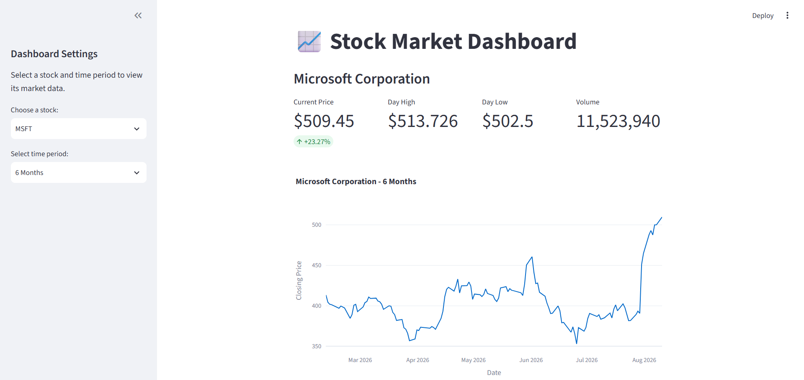

# 📈 Real-Time Stock Market Dashboard

A simple and interactive stock market dashboard built with Python and Streamlit. The application fetches stock market data from Yahoo Finance and displays important market information along with an interactive historical price chart.

## 🚀 Features

* 📊 Real-time stock market information
* 🔎 Select from multiple stocks
* 📅 Choose different time periods
* 💰 Display current stock price
* 📈 Display day high and day low
* 📦 Display trading volume
* 📉 Interactive closing-price chart
* 🖥️ Simple and user-friendly Streamlit interface

## 📌 Available Stocks

The dashboard currently supports:

* Apple (AAPL)
* Microsoft (MSFT)
* Alphabet / Google (GOOGL)
* Amazon (AMZN)
* Tesla (TSLA)

## ⏱️ Available Time Periods

Users can select:

* 1 Month
* 3 Months
* 6 Months
* 1 Year

## 🛠️ Technologies Used

* **Python** – Core programming language
* **Streamlit** – Web dashboard and user interface
* **Requests** – Fetching stock market data
* **Pandas** – Data processing and organization
* **Plotly** – Interactive stock price visualization
* **Yahoo Finance** – Source of stock market data

## 📂 Project Structure

```text
stock-market-dashboard/
│
├── app.py
├── requirements.txt
├── .gitignore
├── README.md
└── screenshots/
    └── dashboard.png
```

## ⚙️ Installation

### 1. Clone the repository

```bash
git clone https://github.com/Mansi-Sharma25/CODEC_PROJECTS.git
```

### 2. Open the project folder

```bash
cd Task4_stock_market_dashboard
```

### 3. Create a virtual environment

```bash
python -m venv venv
```

### 4. Activate the virtual environment

```bash
venv\Scripts\activate
```

### 5. Install the required packages

```bash
pip install -r requirements.txt
```

## ▶️ Run the Application

Start the Streamlit application using:

```bash
streamlit run app.py
```

The dashboard will open in your web browser.

## 📊 How It Works

1. The user selects a stock from the sidebar.
2. The user selects a time period.
3. The application sends a request to Yahoo Finance.
4. The received JSON data is processed using Python.
5. Pandas is used to organize the historical price data.
6. Current price, day high, day low, and volume are displayed.
7. Plotly generates an interactive closing-price chart.
8. Streamlit displays the complete dashboard.

## 🖼️ Screenshots

### Stock Dashboard




## 🎯 Project Objective

The objective of this project is to build a simple real-time financial data dashboard that demonstrates API data retrieval, data processing, interactive visualization, and Streamlit-based web application development.

## 📚 Learning Outcomes

Through this project, I gained practical experience in:

* Working with APIs
* Fetching JSON data using Python
* Processing data using Pandas
* Creating interactive charts using Plotly
* Building dashboards with Streamlit
* Handling API response errors

## 🔮 Future Improvements

Possible future improvements include:

* Adding more stocks
* Adding historical data filters
* Adding additional technical indicators
* Adding comparison between multiple stocks
* Adding automatic data refresh

## 👩‍💻 Author

**Mansi Sharma**

This project is developed as a part of **Codec Python-Developer Internship.**

## ⭐ Acknowledgement

Stock market data is retrieved from Yahoo Finance for educational and demonstration purposes.
